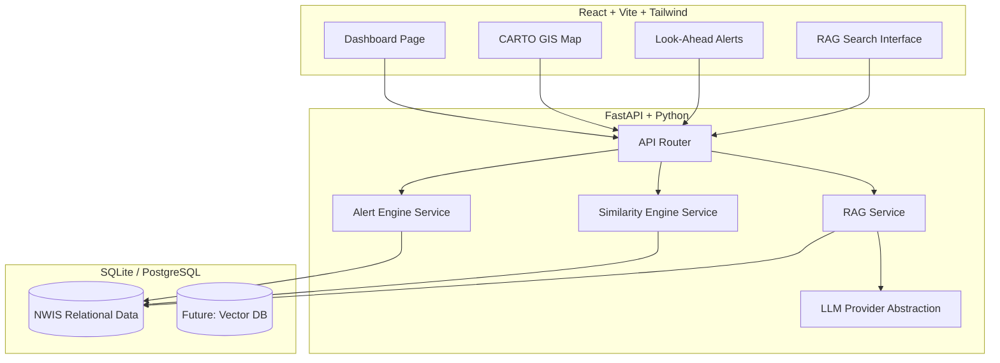

# eRTMAC NWIS: Nearby Wells Intelligence System

**Disclaimer:** This prototype is built strictly using **synthetic/demo data** for the purpose of the hackathon demonstration. It has **NOT** been validated on real Oil India drilling data, nor should it be used as a replacement for professional drilling engineering judgement. 

---

## 📖 Overview

The **Nearby Wells Intelligence System (NWIS)** is an advanced AI-powered decision support tool designed for drilling engineers. It aggregates historical drilling records, parses final well reports (FWR), and cross-references active well trajectories with comparable offset wells to generate **Look-Ahead Historical Context Alerts**.

### Core Value Proposition
Instead of forcing engineers to manually dig through hundreds of PDFs to find out what went wrong in neighboring wells, NWIS proactively pushes historical context to the dashboard based on the active well's current depth and geographic position.

## 🏗️ Architecture



## 🔌 API Documentation

The backend is built with FastAPI and runs on `http://localhost:8001`.

### Data Endpoints
* `GET /api/wells` — List all wells
* `GET /api/wells/{well_id}` — Get details for a specific well
* `GET /api/wells/nearby?lat={lat}&lng={lng}&radius_km={radius}` — Find offset wells in a radius
* `GET /api/events` — List all drilling events

### Intelligence Endpoints
* `GET /api/wells/{well_id}/similar` — Calculates multi-factor similarity scoring (depth, formation, trajectory, distance) between the active well and offset wells.
* `GET /api/correlation/{well_id}` — Normalizes and returns events matched by depth across comparable offset wells.
* `GET /api/alerts/active/{well_id}` — Computes upcoming historical risks within a 200m look-ahead window.

### Search & RAG
* `POST /api/search` — NLP-powered structured query search.
* `POST /api/ask` — Full Retrieval-Augmented Generation pipeline. Returns deterministic evidence-backed answers.

## 🚀 Setup Instructions

### Prerequisites
* Python 3.10+
* Node.js 18+

### 1. Backend Setup
```bash
cd backend
python -m venv venv
# Activate venv (Windows: .\venv\Scripts\activate | Mac/Linux: source venv/bin/activate)
pip install -r requirements.txt
cp .env.example .env

# Seed the mock database
python -m app.db.seed

# Run the backend
uvicorn app.main:app --port 8001 --reload
```

### 2. Frontend Setup
```bash
cd frontend
npm install
npm run dev -- --port 5174
```

## 🎬 Demo Instructions

For judges and reviewers, the application includes a **Guided Demo Mode**. 

1. Launch the application at `http://localhost:5174`.
2. Click the bouncing amber **"Start Judge Demo Mode"** button in the bottom right corner.
3. Follow the 12-step interactive checklist in the floating panel.
4. The guide will step you through identifying the active well, viewing the map, evaluating the depth correlation chart, triaging the Look-Ahead Alerts, and asking the AI a question. 

## ⚠️ Limitations

* **Deterministic Mock LLM:** Out of the box, the system uses a templated Mock LLM provider to ensure the app runs flawlessly locally without API keys. It returns strictly structured facts.
* **Geospatial Distance:** Earth distance is calculated using the Haversine formula on surface coordinates, which does not account for 3D wellbore deviation profiles.
* **Static Depth:** The active well's depth is statically seeded at `2725m` for the demo. In a live system, this would stream via WITSML.

## 🔮 Future Real-Data Integration

To adapt this prototype for live production at Oil India Limited:

1. **WITSML Streaming:** Replace the static `current_depth` field with a real-time WITSML client (e.g., using `witsml-parser`) listening to the rig's data aggregator.
2. **PostgreSQL + pgvector:** Migrate from SQLite to PostgreSQL. Embed historical Final Well Reports (PDFs) into chunks and store them using `pgvector` for advanced semantic search.
3. **Secure LLM Gateway:** Connect the `LLMProvider` abstraction layer to a private, locally-hosted LLM (like Llama 3) or a secure enterprise Azure OpenAI endpoint to comply with data residency requirements.
